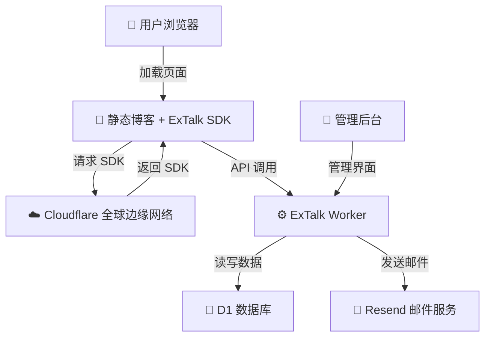

# 什么是 ExTalk?

ExTalk 是一个基于 Cloudflare Workers 和 D1 数据库构建的轻量级评论系统，专为静态博客和网站设计。

## 核心特性

- ⚡ **极速性能** - 部署在 Cloudflare 全球边缘网络，利用 D1 数据库实现毫秒级响应
- 🛡️ **安全可靠** - hCaptcha 人机验证、JWT 身份认证、CORS 域名白名单多重防护
- 🎨 **现代化 UI** - 浅蓝色主题、流畅动画、响应式设计
- 💬 **完整功能** - 支持评论、回复、点赞、页面统计等完整评论系统功能
- 📊 **数据统计** - 页面浏览量、点赞数、IP 属地显示等丰富统计
- 🚀 **简易部署** - 一键部署到 Cloudflare Workers，零服务器维护成本

## 系统架构

## 适用场景

- ✅ 静态博客（Hexo、Hugo、VitePress 等）
- ✅ 个人网站
- ✅ 文档站点
- ✅ 企业官网
- ✅ 任何需要评论功能的静态页面

## 技术栈

- **前端**: 原生 JavaScript SDK，无框架依赖
- **后端**: Cloudflare Workers (TypeScript)
- **数据库**: Cloudflare D1 (SQLite)
- **认证**: JWT + hCaptcha
- **邮件**: Resend API
- **部署**: Wrangler CLI

## 下一步

- [快速开始](/guide/quick-start) - 5 分钟快速集成到你的网站
- [部署指南](/guide/deployment) - 详细的部署步骤
- [API 参考](/api/overview) - 完整的 API 文档
